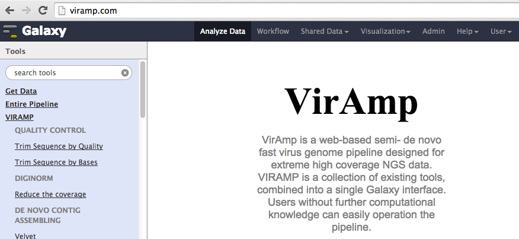
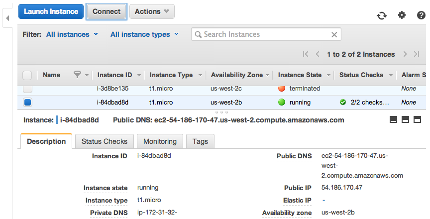
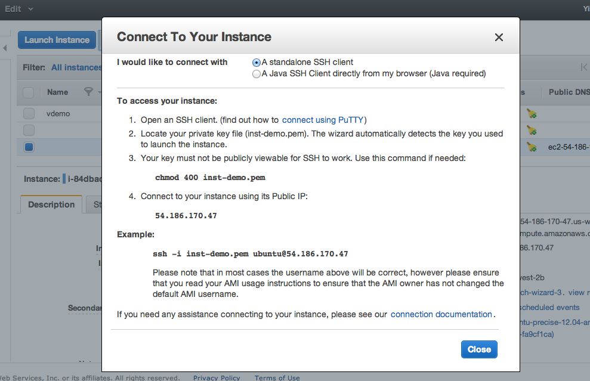

Custom installation of the VirAmp AMI
====================================

Go to http://aws.amazon.com/, in a Web browser.

Select 'My Account/Console' on the top right if you already have an account; otherwise sign up with a new account.

Go to the 'AWS Management Console' option, click the 'EC2' at upper left.

Before importing the AMI, make sure you are in the right Availability zone. Amazon EC2 is hosted in multiple locations world-wide with multiple Availability zones, and resources cannot replicated across regions until specified.  Our AMI is stored at region "US East(N. Virginia)". Check the upper right corner next to your account name, and make sure it's set at the right region. If not, just click and select the right one on from the dropdown menu.

Next, click the blue button 'Launch Instance'.

Step-1: Choosing the instance
-----------------------------

Click the Community AMIs tab at mid-left and simply search "viramp"

Step-2: Review Instance type
-----------------------------

Due to storage and computational requirements, free tier instances are not usable with our AMI. For trial runs it is possible to choose smaller instance types, but for serious usage, it is advised to select at least the m3.large (third option)

.. image:: viramp-doc/review-instance-type.png

Step-3: Launch the Instance
-----------------------------

Step-4: Create Key-pairs
-----------------------------

Congratulations you have successfully launched your own version of the instance.  For information on logging in and starting your instance, please go to :ref:`VirAmp instance login <viramp_login_ref>`

Login to your VirAmp instance and start the server
------------------------------------------------

At this point you have successfully launched your own version of the VirAmp ins\
tance, so what's next?

Start exploring the VirAmp platform
------------------------------------

Open viramp from a browser, typing in public_IP:8080 (for example, the demo is \
viramp.com:8080). The public_IP is the IP assigned to your instance, and by def\
ault the server is open to public via port 8080.

.. _inst_login_ref:

Log in to the new instance
--------------------------------------
Instructions and an overview of the basic steps and parameters you need to logi\
n to the instance are provided at the console.

Hit the "Connect" buttom to view information you need to login to the backend o\
f the system.

Start your terminal and type the following command:

        ``chmod 400 myPemName.pem``

Connect to your instance using your public IP:

        ``ssh -i myPemName.pem ubuntu@public_IP``

Change to the galaxy directory:

        ``cd /mnt/galaxy/galaxy-dist/``

Change viramp settings:

        ``vi universe_wsgi.ini``

        Line 596: admin_users = dwr19@psu.edu should be changed to reflect the \
current administrators email address
        Line 662: ftp_upload_site = viramp.com should be changed from viramp.co\
m to your public ip address

Start the viramp server:

        ``screen``
        ``./run.sh``
        ``CTRL-a-d``