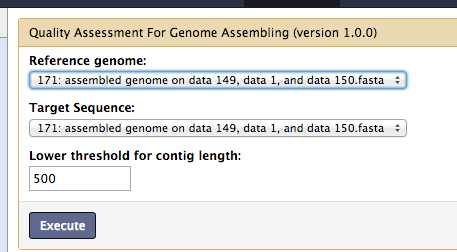
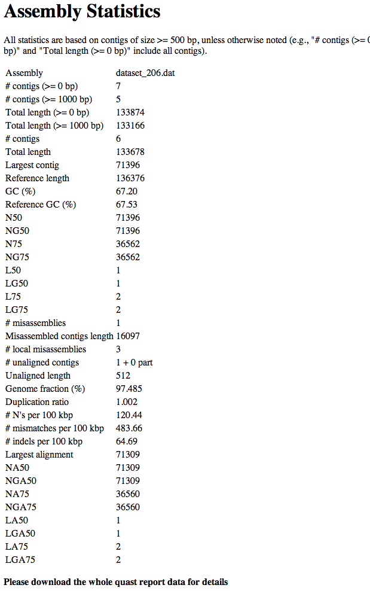
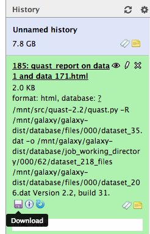
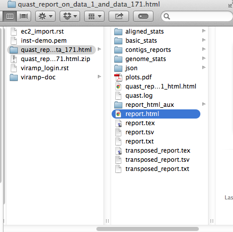
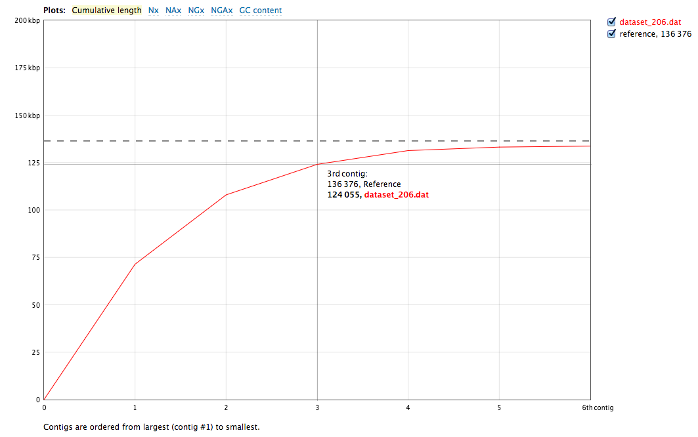
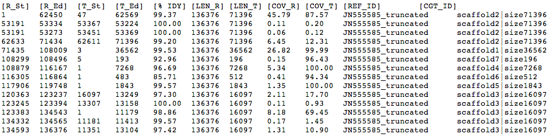
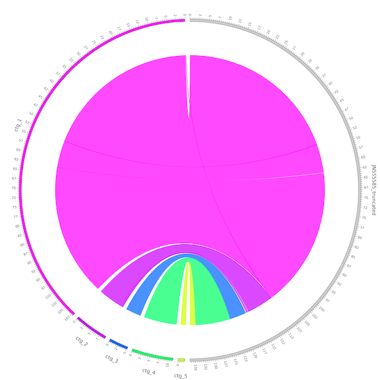
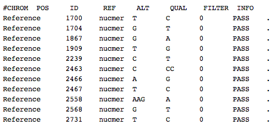
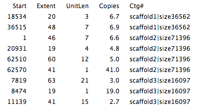

Post-Assembly Analysis
=====================

VirAmp not only provides all the processes related to assembly, but also integrates multiple tools for post-assembly processing including quality assessment and variation analysis.

QUAST REPORT
------------
It is important to evaluate how robust the new assembly is before it is feed into the downstream functional analysis.  VirAmp provides a report of common assembly evaluation metrics based on comparisons with the reference. A detailed `QUAST report <http://bioinf.spbau.ru/quast>`_ can be downloaded for further evaluation.

The inputs required are the reference genome and newly created assembly.

The primary output of QUAST is a summary of common assembly evaluation metrics.

Alternatively, a more detailed QUAST report can also be downloaded.

Unzip and open the report.

A demonstration of a QUAST plot:

Assembly-Reference Alignment
----------------------------

VirAmp provides information about the difference between the reference and new assembly based on a MUMmer alignment.  Coordinates and percentage identities are provided for each aligned region between these two sequences.  This is useful in identifying large INDELs as well as other complex structural variations. Table 1 demonstrates an example of the comparison report generated by this tool.

Circos graph visualization
--------------------------

Circos projects the assembled draft genome to the aligned part of the reference genome, creating a straightforward visualization for the above alignment and providing insight into large structural variations.

SNP analysis
-------------

Using the alignment between the assembly and the reference, SNP information is  displayed in VCF format.

Repeat and Tandem repeat analysis
---------------------------------

By aligning the assembly against itself, VirAmp additionally provides repeat and tandem repeat information. The starting coordinates and lengths of the repeats are dervied from this alignment.

