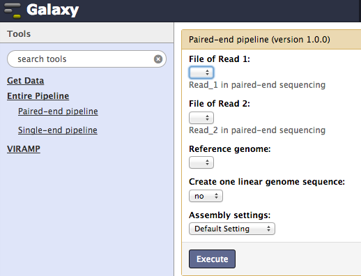
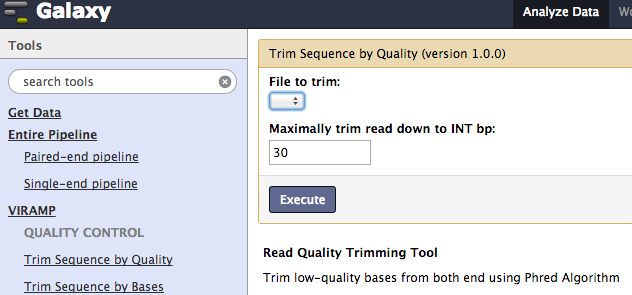
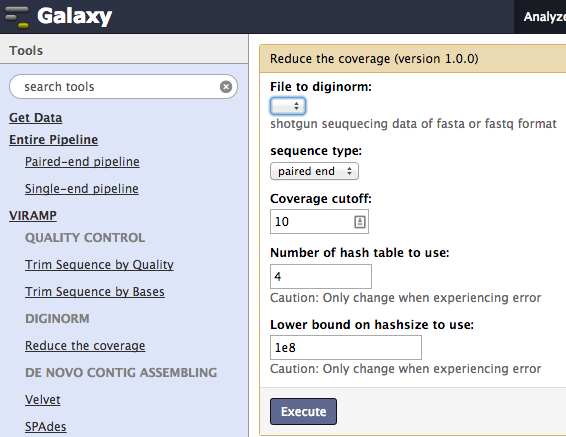
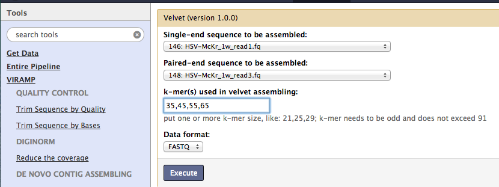
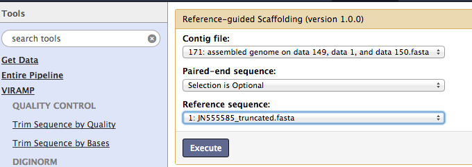
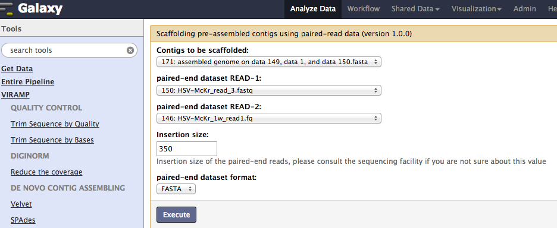
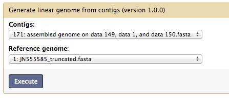

Usage
=====

This is a general description of the usage and function of each tool found in the `VirAmp pipeline <http://viramp.com/>`_. A more detailed description can be found at the webpage of each tool.

One-click pipeline
------------------

Two general pipelines are provided with a one-click option, one for paired-end data and the other for single-end data.  Users are only required to submit read files and a reference file corresponding to their data.  Alongside the default settings, users may use the "advanced setting" option to custom configure the pipeline with alternative parameters.

Step-by-Step Process
---------------------

Next we provide a chronological introduction of each step in the pipeline.

Quality Control
---------------
First, trim out the low quality bases of the input fastq files. This can be achieved either by removing low quality bases or mandatorily trimming a certain length from each end.

Diginorm
--------
Next, reduce coverage and bias using `Digital normalization <http://ged.msu.edu/papers/2012-diginorm/>`_. This step reduces the sample variation as well as sample bias.

`de novo` Contig assembly
------------------------
Next, the pipeline assembles the short reads into longer contigs, by default the **One-click pipeline** uses `velvet <https://www.ebi.ac.uk/~zerbino/velvet/>`_. Two alternatives, `SPAdes <http://bioinf.spbau.ru/spades>`_ and `VICUNA <http://www.broadinstitute.org/scientific-community/science/projects/viral-genomics/vicuna>`_ , are provided and can be selected either as individual tools or through the advanced options in the one-click pipeline.

Reference-based scaffolding
---------------------------
Next, the contigs are assembled into even longer `super-contigs`. This step is a modification of `AMOScmp <http://sourceforge.net/apps/mediawiki/amos/index.php?title=AMOScmp>`_ 

Reference-independent scaffolding
---------------------------------
This step extends the super-contigs and connects them using `SSPACE <http://www.baseclear.com/landingpages/basetools-a-wide-range-of-bioinformatics-solutions/sspacev12/>`_.  At the end of this step, the pipeline will produce a draft genome, which is a multi-fasta usually contains 5~15 contigs, listed in the same order as the reference.

Gap closing
-----------
This step connects all the contigs in the multi-fasta from the previous step into one linear genome. This is for the convenience of downstream functional analysis.  However, this is **optional** and highly recommended to be done only after assessing the draft genome, as the gaps between the contigs could from misassembly, sequencing, genome feature, etc. 

