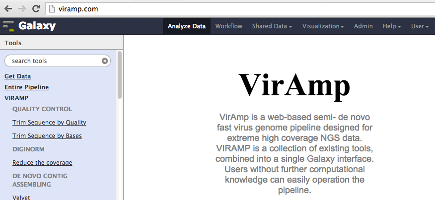
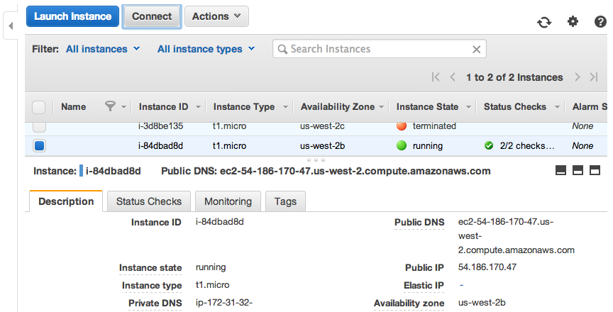
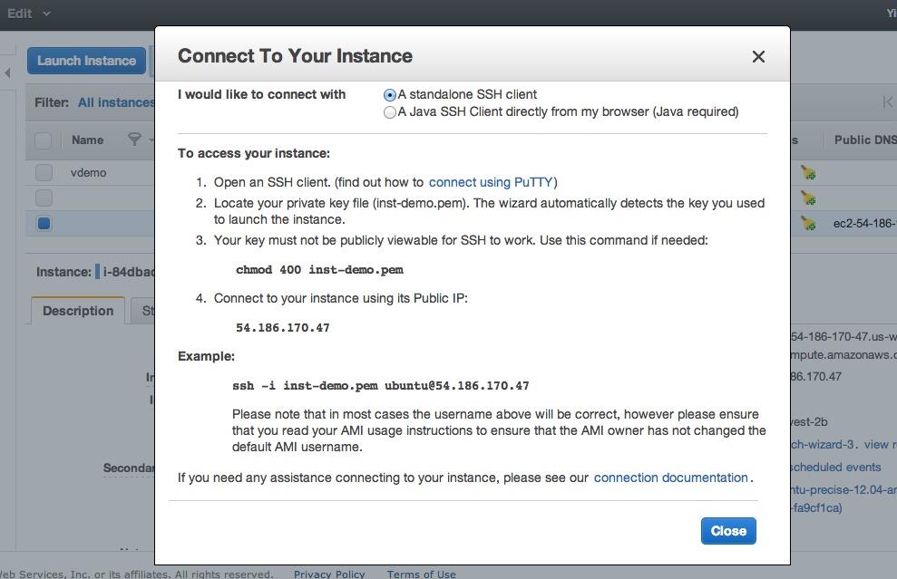

.. _viramp_login_ref:

Login to your VirAmp instance and start the server
==================================================

At this point you have successfully launched your own version of the VirAmp instance, so what's next?

Start exploring the VirAmp platform
------------------------------------

Open viramp from a browser, typing in public_IP:8080 (for example, the demo is viramp.com:8080). The public_IP is the IP assigned to your instance, and by default the server is open to public via port 8080.

.. _inst_login_ref:

Log in to the new instance
--------------------------------------
 
Instructions and an overview of the basic steps and parameters you need to login to the instance are provided at the console.

Hit the "Connect" buttom to view information you need to login to the backend of the system.

Start your terminal and type the following command:

        ``chmod 400 myPemName.pem``

Connect to your instance using your public IP:

        ``ssh -i myPemName.pem ubuntu@public_IP``

Change to the galaxy directory:

        ``cd /mnt/galaxy/galaxy-dist/``

Change viramp settings:

        ``vi universe_wsgi.ini``

	Line 596: admin_users = dwr19@psu.edu should be changed to reflect the current administrators email address
	Line 662: ftp_upload_site = viramp.com should be changed from viramp.com to your public ip address

Start the viramp server:

        ``screen``
	``./run.sh``
	``CTRL-a-d``

